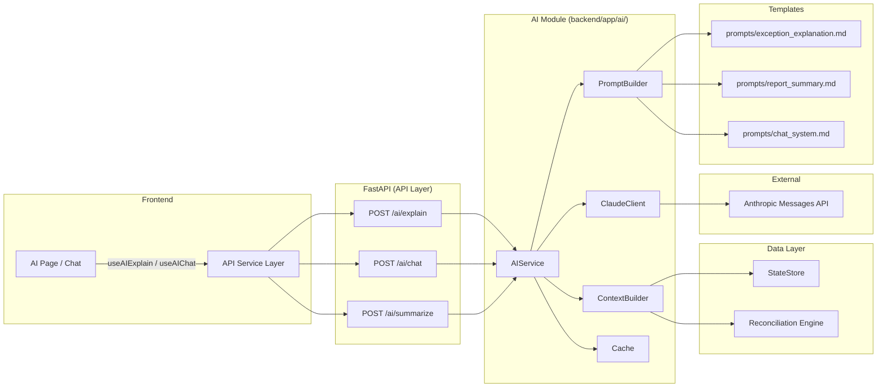

# AI Architecture — FinancePilot

## Overview

FinancePilot AI adds LLM-powered intelligence to the existing reconciliation
platform. Users can ask the AI to explain exceptions, summarise reports, and
suggest resolution strategies — all grounded in their actual data.

The architecture is designed around three principles:

1. **Separation of concerns** — data gathering, prompt rendering, and LLM
   calling live in distinct, independently testable modules.
2. **Provider agnosticism** — the `BaseLLMClient` interface means Claude can
   be swapped for any provider without touching business logic.
3. **Graceful degradation** — every AI feature works in placeholder mode when
   no API key is configured.

---

## Architecture Diagram



---

## Component Details

### 1. Context Builder (`context_builder.py`)

**Purpose:** Gather all domain data the LLM needs to produce a grounded answer.

| Input | Output |
|---|---|
| Exception ID | `ExceptionContext` — exception details, bank record, gateway record |
| Chat message | `ChatContext` — message, history, active run metadata |
| Run ID | `ReportSummaryContext` — financial summary, rule distribution |

**Key decisions:**
- Context objects are frozen dataclasses — immutable snapshots.
- The builder queries `StateStore` but never mutates it.
- A future token budget parameter will truncate context to stay within
  the model's window.

### 2. Prompt Builder (`prompt_builder.py`)

**Purpose:** Render domain context into the `messages` list expected by the
Anthropic Messages API.

- Templates live in `prompts/` as Markdown files — **never hardcoded**.
- Uses Python `string.Template` for `$variable` interpolation.
- The system prompt is loaded from `chat_system.md` and passed separately.

### 3. Claude Client (`claude_client.py`)

**Purpose:** Thin adapter over the Anthropic SDK.

- Implements `BaseLLMClient` — the **only** file that imports `anthropic`.
- Handles retries, timeouts, and rate-limit back-off.
- Returns a standardised `LLMResponse` dataclass.

### 4. AI Service (`ai_service.py`)

**Purpose:** Orchestration facade called by the FastAPI endpoint layer.

```
explain_exception(id) → ContextBuilder → PromptBuilder → ClaudeClient → Response
chat(message)         → ContextBuilder → PromptBuilder → ClaudeClient → Response
summarize_report(id)  → ContextBuilder → PromptBuilder → ClaudeClient → Response
```

Each method checks the cache first and stores responses after a successful
LLM call.

---

## LLM Flow (Request Lifecycle)

```
1. HTTP request hits /ai/explain
2. FastAPI validates the Pydantic schema
3. AIService.explain_exception() is called
4. ContextBuilder fetches the exception + related records from StateStore
5. PromptBuilder renders exception_explanation.md with the context
6. Cache is checked — if hit, return immediately
7. ClaudeClient.complete() calls the Anthropic Messages API
8. Response is cached with configurable TTL
9. Structured result is returned to the frontend
```

---

## Token Optimisation Strategy

| Strategy | Status |
|---|---|
| Context truncation to stay within window | 🟡 Planned |
| Prompt template minification (remove comments before sending) | 🟡 Planned |
| Response caching by (exception_id + data hash) | 🟡 Interface ready |
| Streaming responses for long explanations | 🔴 Future |
| Batch explanation for multiple exceptions | 🔴 Future |

**Token budget allocation (per request):**
- System prompt: ~500 tokens
- User context: ~1,500 tokens (max)
- Model response: up to `AI_MAX_TOKENS` (default 2,048)

---

## Configuration

All AI settings live in `backend/app/core/config.py`:

```python
AI_PROVIDER: str = "anthropic"
AI_MODEL: str = "claude-sonnet-4-20250514"
AI_TEMPERATURE: float = 0.3
AI_MAX_TOKENS: int = 2048
AI_TIMEOUT: int = 30        # seconds
AI_CACHE_TTL: int = 3600    # seconds
ANTHROPIC_API_KEY: str = ""  # from .env
```

---

## Future: MCP (Model Context Protocol) Support

FinancePilot's architecture is pre-aligned for MCP adoption:

| MCP Concept | FinancePilot Equivalent |
|---|---|
| **Tools** | `ContextBuilder` methods become tool functions the model can invoke |
| **Resources** | `StateStore` data (exceptions, reports) exposed as typed resources |
| **Prompts** | `prompts/` directory already externalises prompt templates |

When MCP support is added:
1. Each `ContextBuilder` method is registered as an MCP tool.
2. The model decides which tools to call based on the user's question.
3. Tool results are automatically injected into the conversation context.

This will allow the AI to dynamically pull exactly the data it needs
rather than receiving a pre-built context blob.

---

## File Map

```
backend/app/ai/
├── __init__.py
├── README.md
├── ai_service.py          ← Orchestration facade
├── claude_client.py       ← Anthropic SDK adapter
├── context_builder.py     ← Domain data gathering
├── prompt_builder.py      ← Template rendering
├── llm.py                 ← Deprecated stub
└── prompts/
    ├── chat_system.md
    ├── exception_explanation.md
    └── report_summary.md

backend/app/core/
├── cache.py               ← Cache interface + InMemoryCache
└── config.py              ← AI_* settings

frontend/src/components/ai/
├── ChatWindow.tsx
├── ConfidenceBadge.tsx
├── MessageBubble.tsx
├── SuggestionChip.tsx
├── ThinkingIndicator.tsx
└── index.ts

frontend/src/types/
└── ai.ts                  ← Shared AI type definitions

frontend/src/lib/api/services/
└── ai.ts                  ← explainException, chat, summarizeReport
```
