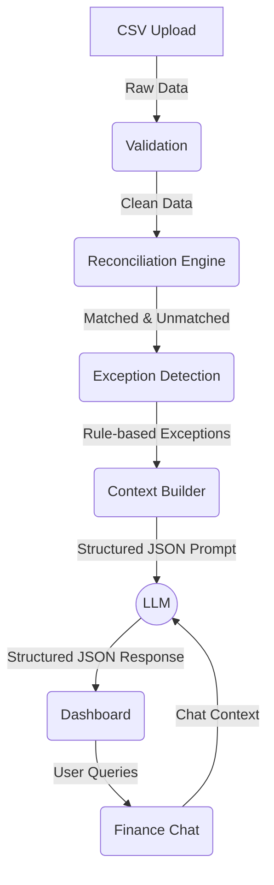

# AI Workflow

This document details the pipeline used to process data, detect exceptions, and leverage the LLM (Anthropic Claude) to generate explanations and power the Finance Chat.

## Pipeline Architecture

The system processes data sequentially, extracting only the necessary context before sending it to the AI.

## The Role of the Context Builder

Instead of feeding raw CSV files directly into the Large Language Model, FinancePilot AI uses a **Context Builder** step. 

### Why Structured Context over Raw CSV?

1. **Token Efficiency and Cost:** Raw CSVs contain massive amounts of redundant data (e.g., hundreds of perfectly matched, issue-free transactions). Sending this to an LLM wastes context window space and significantly increases API costs.
2. **Hallucination Reduction:** By pre-processing the data with a deterministic `Reconciliation Engine` and `Exception Detection` rules, we isolate the exact mathematical discrepancies. The LLM is given a highly specific JSON payload (e.g., *“Gateway fee is $20, but Settlement fee deducted is $22”*) rather than being asked to do the math itself, which LLMs often struggle with reliably.
3. **Speed and Latency:** Generating a response for a targeted JSON payload is exponentially faster than asking the LLM to parse, join, and analyze thousands of rows of CSV text.
4. **Data Privacy (PII):** The Context Builder can easily redact or hash Personally Identifiable Information (PII) like Customer Names before the payload leaves the server to hit the external LLM API.

The AI is treated as an *interpreter and explainer* of the exceptions, rather than a raw data processing engine.
